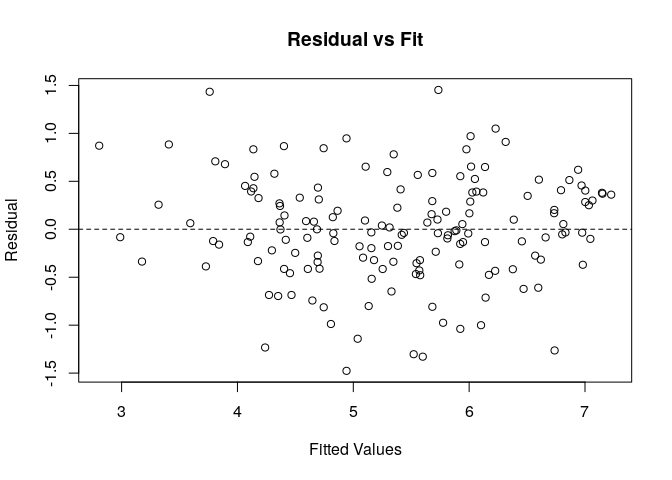
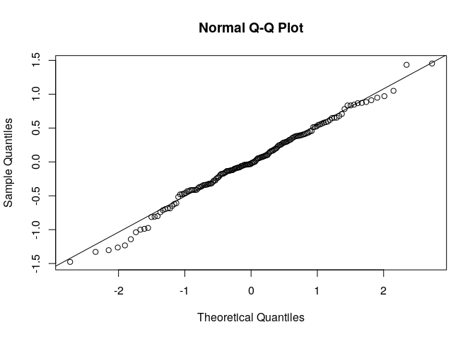

Projectpstat126
================
Luis Aragon
September 8, 2018

This is a projest using Linear Regression to analyze happiness data.

Explore Data
------------

``` r
# Access Data
data_dir <- "/home/lma/Documents/STATS/PSTAT126/Project/data"
happy_file <- file.path(data_dir, "2015.csv")
happy.data <- read.csv(happy_file, header = TRUE)

#Remove unwanted columns
happy.data$Country = NULL
happy.data$Happiness.Rank = NULL
happy.data$Standard.Error = NULL
happy.data$Dystopia.Residual = NULL
happy.data$Region = NULL

head(happy.data)
```

    ##   Happiness.Score Economy..GDP.per.Capita.  Family
    ## 1           7.587                  1.39651 1.34951
    ## 2           7.561                  1.30232 1.40223
    ## 3           7.527                  1.32548 1.36058
    ## 4           7.522                  1.45900 1.33095
    ## 5           7.427                  1.32629 1.32261
    ## 6           7.406                  1.29025 1.31826
    ##   Health..Life.Expectancy. Freedom Trust..Government.Corruption.
    ## 1                  0.94143 0.66557                       0.41978
    ## 2                  0.94784 0.62877                       0.14145
    ## 3                  0.87464 0.64938                       0.48357
    ## 4                  0.88521 0.66973                       0.36503
    ## 5                  0.90563 0.63297                       0.32957
    ## 6                  0.88911 0.64169                       0.41372
    ##   Generosity
    ## 1    0.29678
    ## 2    0.43630
    ## 3    0.34139
    ## 4    0.34699
    ## 5    0.45811
    ## 6    0.23351

Find Best Model Using Stepwise Regression
-----------------------------------------

``` r
attach(happy.data)
mod = lm(Happiness.Score ~ 1, data = happy.data)
mod.upper = lm(Happiness.Score ~ ., data = happy.data)

step(mod, scope = list(lower = mod, upper = mod.upper))
```

    ## Start:  AIC=43.79
    ## Happiness.Score ~ 1
    ## 
    ##                                 Df Sum of Sq     RSS      AIC
    ## + Economy..GDP.per.Capita.       1   125.540  80.295 -102.949
    ## + Family                         1   112.899  92.935  -79.850
    ## + Health..Life.Expectancy.       1   107.953  97.882  -71.656
    ## + Freedom                        1    66.456 139.378  -15.814
    ## + Trust..Government.Corruption.  1    32.148 173.687   18.956
    ## + Generosity                     1     6.693 199.142   40.565
    ## <none>                                       205.835   43.787
    ## 
    ## Step:  AIC=-102.95
    ## Happiness.Score ~ Economy..GDP.per.Capita.
    ## 
    ##                                 Df Sum of Sq     RSS      AIC
    ## + Family                         1    19.752  60.542 -145.562
    ## + Freedom                        1    18.571  61.723 -142.509
    ## + Generosity                     1     7.314  72.981 -116.039
    ## + Trust..Government.Corruption.  1     5.445  74.849 -112.045
    ## + Health..Life.Expectancy.       1     4.626  75.668 -110.325
    ## <none>                                        80.295 -102.949
    ## - Economy..GDP.per.Capita.       1   125.540 205.835   43.787
    ## 
    ## Step:  AIC=-145.56
    ## Happiness.Score ~ Economy..GDP.per.Capita. + Family
    ## 
    ##                                 Df Sum of Sq    RSS     AIC
    ## + Freedom                        1    10.067 50.476 -172.29
    ## + Trust..Government.Corruption.  1     5.250 55.292 -157.89
    ## + Generosity                     1     4.720 55.822 -156.39
    ## + Health..Life.Expectancy.       1     4.445 56.097 -155.61
    ## <none>                                       60.542 -145.56
    ## - Family                         1    19.752 80.295 -102.95
    ## - Economy..GDP.per.Capita.       1    32.393 92.935  -79.85
    ## 
    ## Step:  AIC=-172.29
    ## Happiness.Score ~ Economy..GDP.per.Capita. + Family + Freedom
    ## 
    ##                                 Df Sum of Sq    RSS     AIC
    ## + Health..Life.Expectancy.       1    3.1304 47.345 -180.41
    ## + Generosity                     1    1.0278 49.448 -173.54
    ## + Trust..Government.Corruption.  1    0.9629 49.513 -173.34
    ## <none>                                       50.476 -172.29
    ## - Freedom                        1   10.0665 60.542 -145.56
    ## - Family                         1   11.2478 61.723 -142.51
    ## - Economy..GDP.per.Capita.       1   27.5824 78.058 -105.41
    ## 
    ## Step:  AIC=-180.41
    ## Happiness.Score ~ Economy..GDP.per.Capita. + Family + Freedom + 
    ##     Health..Life.Expectancy.
    ## 
    ##                                 Df Sum of Sq    RSS     AIC
    ## + Trust..Government.Corruption.  1    1.1928 46.152 -182.44
    ## <none>                                       47.345 -180.41
    ## + Generosity                     1    0.5125 46.833 -180.13
    ## - Health..Life.Expectancy.       1    3.1304 50.476 -172.29
    ## - Economy..GDP.per.Capita.       1    5.3849 52.730 -165.39
    ## - Freedom                        1    8.7520 56.097 -155.61
    ## - Family                         1   11.5095 58.855 -148.03
    ## 
    ## Step:  AIC=-182.44
    ## Happiness.Score ~ Economy..GDP.per.Capita. + Family + Freedom + 
    ##     Health..Life.Expectancy. + Trust..Government.Corruption.
    ## 
    ##                                 Df Sum of Sq    RSS     AIC
    ## <none>                                       46.152 -182.44
    ## + Generosity                     1    0.3004 45.852 -181.47
    ## - Trust..Government.Corruption.  1    1.1928 47.345 -180.41
    ## - Health..Life.Expectancy.       1    3.3603 49.513 -173.34
    ## - Economy..GDP.per.Capita.       1    4.3337 50.486 -170.26
    ## - Freedom                        1    4.6399 50.792 -169.31
    ## - Family                         1   12.3001 58.453 -147.11

    ## 
    ## Call:
    ## lm(formula = Happiness.Score ~ Economy..GDP.per.Capita. + Family + 
    ##     Freedom + Health..Life.Expectancy. + Trust..Government.Corruption., 
    ##     data = happy.data)
    ## 
    ## Coefficients:
    ##                   (Intercept)       Economy..GDP.per.Capita.  
    ##                        1.8982                         0.8053  
    ##                        Family                        Freedom  
    ##                        1.4164                         1.4426  
    ##      Health..Life.Expectancy.  Trust..Government.Corruption.  
    ##                        1.0338                         0.8540

Using Best Subsets Regression
-----------------------------

``` r
library(leaps)
modsubset = regsubsets(happy.data[,-1], happy.data$Happiness.Score)

# Summary of Models
summary(modsubset)$which
```

    ##   (Intercept) Economy..GDP.per.Capita. Family Health..Life.Expectancy.
    ## 1        TRUE                     TRUE  FALSE                    FALSE
    ## 2        TRUE                     TRUE   TRUE                    FALSE
    ## 3        TRUE                     TRUE   TRUE                    FALSE
    ## 4        TRUE                     TRUE   TRUE                     TRUE
    ## 5        TRUE                     TRUE   TRUE                     TRUE
    ## 6        TRUE                     TRUE   TRUE                     TRUE
    ##   Freedom Trust..Government.Corruption. Generosity
    ## 1   FALSE                         FALSE      FALSE
    ## 2   FALSE                         FALSE      FALSE
    ## 3    TRUE                         FALSE      FALSE
    ## 4    TRUE                         FALSE      FALSE
    ## 5    TRUE                          TRUE      FALSE
    ## 6    TRUE                          TRUE       TRUE

``` r
# Summary of Adjusted R Squared
summary(modsubset)$adjr2
```

    ## [1] 0.6074066 0.7020743 0.7499983 0.7639704 0.7684031 0.7683870

``` r
# Summary of Mallows Cp
summary(modsubset)$cp
```

    ## [1] 110.426379  47.377792  16.226709   7.917546   5.989440   7.000000

Checking Distribution of Residuals
----------------------------------

``` r
#F Test for New Model
mod.red = lm(Happiness.Score ~ 1)
mod.full = lm(Happiness.Score ~ Economy..GDP.per.Capita. + Family + 
    Freedom + Health..Life.Expectancy. + Trust..Government.Corruption., 
    data = happy.data)
anova(mod.red, mod.full)
```

    ## Analysis of Variance Table
    ## 
    ## Model 1: Happiness.Score ~ 1
    ## Model 2: Happiness.Score ~ Economy..GDP.per.Capita. + Family + Freedom + 
    ##     Health..Life.Expectancy. + Trust..Government.Corruption.
    ##   Res.Df     RSS Df Sum of Sq      F    Pr(>F)    
    ## 1    157 205.835                                  
    ## 2    152  46.152  5    159.68 105.18 < 2.2e-16 ***
    ## ---
    ## Signif. codes:  0 '***' 0.001 '**' 0.01 '*' 0.05 '.' 0.1 ' ' 1

``` r
#Plot Residual vs. Fit
yhat = fitted(mod.full)
e = Happiness.Score - yhat
plot(yhat, e, xlab = 'Fitted Values', ylab = 'Residual', main = 'Residual vs Fit')
abline(h = 0, lty = 2)
```



``` r
#Plot Normal QQ
qqnorm(e)
qqline(e)
```



``` r
#Shapiro-Wilk Test
shapiro.test(e)
```

    ## 
    ##  Shapiro-Wilk normality test
    ## 
    ## data:  e
    ## W = 0.99092, p-value = 0.4107

``` r
# Identify Max Values
econ.max = max(Economy..GDP.per.Capita.)
family.max = max(Family)
freedom.max = max(Freedom)
health.max = max(Health..Life.Expectancy.)
trust.max = max(Trust..Government.Corruption.)
econ.max
```

    ## [1] 1.69042

``` r
family.max
```

    ## [1] 1.40223

``` r
freedom.max
```

    ## [1] 0.66973

``` r
health.max
```

    ## [1] 1.02525

``` r
trust.max
```

    ## [1] 0.55191

``` r
head(happy.data)
```

    ##   Happiness.Score Economy..GDP.per.Capita.  Family
    ## 1           7.587                  1.39651 1.34951
    ## 2           7.561                  1.30232 1.40223
    ## 3           7.527                  1.32548 1.36058
    ## 4           7.522                  1.45900 1.33095
    ## 5           7.427                  1.32629 1.32261
    ## 6           7.406                  1.29025 1.31826
    ##   Health..Life.Expectancy. Freedom Trust..Government.Corruption.
    ## 1                  0.94143 0.66557                       0.41978
    ## 2                  0.94784 0.62877                       0.14145
    ## 3                  0.87464 0.64938                       0.48357
    ## 4                  0.88521 0.66973                       0.36503
    ## 5                  0.90563 0.63297                       0.32957
    ## 6                  0.88911 0.64169                       0.41372
    ##   Generosity
    ## 1    0.29678
    ## 2    0.43630
    ## 3    0.34139
    ## 4    0.34699
    ## 5    0.45811
    ## 6    0.23351

``` r
# Create New Data Frame with Max of Each Predictor
new.max = data.frame(Economy..GDP.per.Capita.=econ.max, Family=family.max, Freedom=freedom.max, Health..Life.Expectancy.=health.max, Trust..Government.Corruption.=trust.max)
pi.max = predict(mod.full, new.max, interval = 'prediction', level = 0.95)
pi.max
```

    ##        fit      lwr      upr
    ## 1 7.743114 6.606753 8.879475

``` r
# Identify Min Values
econ.min = min(Economy..GDP.per.Capita.)
family.min = min(Family)
freedom.min = min(Freedom)
health.min = min(Health..Life.Expectancy.)
trust.min = min(Trust..Government.Corruption.)

# Create New Data Frame with Max of Each Predictor
new.min = data.frame(Economy..GDP.per.Capita.=econ.min, Family=family.min, Freedom=freedom.min, Health..Life.Expectancy.=health.min, Trust..Government.Corruption.=trust.min)

pi.min = predict(mod.full, new.min, interval = 'prediction', level = 0.95)
pi.min
```

    ##        fit       lwr      upr
    ## 1 1.898207 0.7488108 3.047604

``` r
# Identify Mean Values
econ.mean = mean(Economy..GDP.per.Capita.)
family.mean = mean(Family)
freedom.mean = mean(Freedom)
health.mean = mean(Health..Life.Expectancy.)
trust.mean = mean(Trust..Government.Corruption.)

# Create New Data Frame with Max of Each Predictor
new.mean = data.frame(Economy..GDP.per.Capita.=econ.mean, Family=family.mean, Freedom=freedom.mean, Health..Life.Expectancy.=health.mean, Trust..Government.Corruption.=trust.mean)
pi.mean = predict(mod.full, new.mean, interval = 'prediction', level = 0.95)
pi.mean
```

    ##        fit      lwr      upr
    ## 1 5.375734 4.283627 6.467842

``` r
mod.full = lm(Happiness.Score ~ Economy..GDP.per.Capita. + Family + 
    Freedom + Health..Life.Expectancy. + Trust..Government.Corruption., 
    data = happy.data)

mod.full.interaction = lm(Happiness.Score ~ Economy..GDP.per.Capita. + Family + 
    Freedom + Health..Life.Expectancy. + Trust..Government.Corruption. + Economy..GDP.per.Capita.*Family + Economy..GDP.per.Capita.*Freedom + Economy..GDP.per.Capita.*Health..Life.Expectancy. + Economy..GDP.per.Capita.*Trust..Government.Corruption., data = happy.data)

anova(mod.full, mod.full.interaction)
```

    ## Analysis of Variance Table
    ## 
    ## Model 1: Happiness.Score ~ Economy..GDP.per.Capita. + Family + Freedom + 
    ##     Health..Life.Expectancy. + Trust..Government.Corruption.
    ## Model 2: Happiness.Score ~ Economy..GDP.per.Capita. + Family + Freedom + 
    ##     Health..Life.Expectancy. + Trust..Government.Corruption. + 
    ##     Economy..GDP.per.Capita. * Family + Economy..GDP.per.Capita. * 
    ##     Freedom + Economy..GDP.per.Capita. * Health..Life.Expectancy. + 
    ##     Economy..GDP.per.Capita. * Trust..Government.Corruption.
    ##   Res.Df    RSS Df Sum of Sq     F  Pr(>F)  
    ## 1    152 46.152                             
    ## 2    148 43.340  4    2.8124 2.401 0.05254 .
    ## ---
    ## Signif. codes:  0 '***' 0.001 '**' 0.01 '*' 0.05 '.' 0.1 ' ' 1
